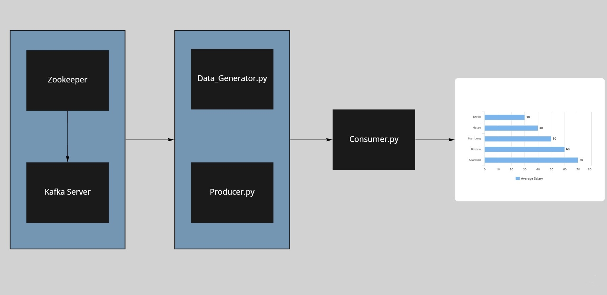

# Kafka_With_Python

### Table of Contents

- [Overview](#overview)
- [Kafka](#kafka)
  - [Kafka Installation](#kafka-installation)
  - [Java](#java)
  - [Python](#python)
  - [Kafka Manager](#kafka-manager)
  - [Zookeeper and Kafka](#zookeeper-and-kafka)
- [Folder Structure](#folder-structure)
- [Program Flow](#program-flow)
- [Documentation](#documentation)


---

### Overview

- Learn about Kafka and how is can be used in streaming data.
- How we can have multiple producers and consumers.
- Using kafka manager to see how much data is being consumed.
- Generated sales data in json and used Kafka with python to push this data to Power BI.

---

### Kafka

- Apache Kafka is a distributed event store and stream-processing platform.
- Publish (write) and subscribe to (read) streams of events, including continuous import/export of your data from other systems.
- Store streams of events durably and reliably for as long as you want.
- Process streams of events as they occur or retrospectively.


### Kafka Installation

- For installing and running Kafka we have to install some programs.

#### Java

- Java 11 installed in our system, why java 11 because the cluster manager UI for kafka requires java 11. 
- I have installed Zulu Java 11 for ubuntu and then added its path in my system.

- After you have installed Java 11 will need to set the paths
```bash
  vim ~/.bashrc
```
- Once you have enter vim press **i** so that you can be in insert mode. Paste the below.
```bash
  export JAVA_HOME=/home/ubuntu/Java/zulu8.60.0.21-ca-jdk8.0.322-linux_x64
  export PATH=$PATH:$JAVA_HOME/bin
```

- Press **Esc** and enter **:x** to exit vim. 
- Now to update the bashrc file
```bash
  source ~/.bashrc
```

#### Python

```bash
  sudo apt-get update
```
```bash
  sudo apt-get install python3
```
```bash
  sudo apt-get install pip
```
```bash
  vim ~/.bashrc
```
```bash
  export PATH=$PATH:/home/ubuntu/.local/bin
```
```bash
  source ~/.bashrc
```


#### Kafka Manager 

- Kafka manager we can create topics and see the metrics of how data is being pushed and consumed.

```bash
  git clone https://github.com/yahoo/CMAK.git
```
```bash
  ./sbt clean <dist>
```

- Target folder will be created and an universal folder which will have a zip folder and we need to unzip it to get the html files.
- Inside the **cmak.zkhosts** file we need to provide our IP.
- This sort of folder structure **CMAK/target/universal/cmak-3.0.0.5**

- Inside conf we will have application.conf

- After all of this we will now start our kafka manager
```bash
bin/cmak -Dconfig.file=conf/application.conf -Dhttp.port=8080
```
- To access kafka manager UI
```bash
http://localhost:8080/
```
- Use browser of your choice and will open the Kafka Manager where we can make clusters, topics etc


### Zookeeper and Kafka

- Now we install zookeeper and kafka server both will be in the same file will download this from google just type kafka download.
- Download the zip file and unzip it and will get the folder

- In the Conf File of Kafka Server we need to provide our IP of machine on which kafka is hosted and similarly for zookeeper
- We are defining the ports 
```bash
  server.properties
  advertised.listeners=PLAINTEXT://your.host.name:9092
  zookeeper.connect=localhost:2181
```


- Change Directory to the kafka directory start the zookeeper after the above Changes have been made. 

- Open Terminal
- This will start Zookeeper
```bash
  bin/zookeeper-server-start.sh config/zookeeper.properties
```

- Start the kafka server we use JMX so that we can use Cluster Manger UI to make topics and have more details 
```bash
  JMX_PORT=8004 bin/kafka-server-start.sh config/server.properties
```

---

### Folder Structure

- Producer.py
- Consumer.py
- Data_Generator.py
- Kafka_Power_BI.ipynb

---

### Program Flow

<p align="center">
  
</p>

---

### Documentation

- https://kafka.apache.org/documentation/
- https://kafka-python.readthedocs.io/en/master/#:~:text=kafka%2Dpython%20is%20designed%20to,be%20enabled%20on%20newer%20brokers.
- https://www.youtube.com/playlist?list=PLxoOrmZMsAWxXBF8h_TPqYJNsh3x4GyO4

